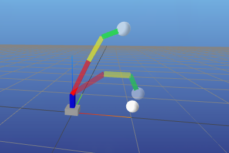

<div align="center">
<h1>Neo Construct</h1>
</div>

A ready-to-go robotics optimal control setup in the form of a [Docker](https://www.docker.com/) container.
The Neo Construct encapsulates a whole [ROS2](https://github.com/ros2) [Gazebo Jetty](https://gazebosim.org/docs/latest/ros2_integration/) environment to solve robotics problems with a pipeline of [Acados](https://docs.acados.org/) and [Pinocchio](https://stack-of-tasks.github.io/pinocchio/).

It only uses Docker and Make to manage the Docker.
So this setup can be used directly from the command line without requiring any additional software.

### Quick Start

1. Clone the repository or create your own with this as a template

```bash
git clone --recursive https://github.com/DominicZahn/Neo-Construct.git
```

2. Enter the parent directory, which holds the `Dockerfile` and `Makefile`. From there build the Docker with

```bash
make build
```

> The first time this will take a long time (~1-2h), as it builds lots of packages from source.

3. After the Docker was built successfully it can be run by

```bash
make run
```

4. Now inside the `neo-construct` container you can enjoy the whole containerized environment by starting up on of the examples. The docker can be controlled by the `Makefile` and general [docker commands](https://docs.docker.com/get-started/docker_cheatsheet.pdf).

### Examples

#### `simple_example`

Here are basic examples that do not require a running simulation or ROS2 in general.

##### `arm.py`

A small three segment robot arm model is defined using the `arm.urdf`.
It's task is to move the end effector from the default position to the provided target position.
Both are marked with a white ball.

For rigid-body dynamics Pinocchio is utilized with Acados as an optimal control framework.
This example provides a good starting point to learn about Pinocchio and Acados in general without the need of a difficult model or overhead from an external simulation.

First launch the python script with

```bash
python3 arm.py
```

> Be aware that this needs to be run from inside the `simple_example` folder.

The script uses [MeshCat](https://github.com/meshcat-dev/meshcat) for visualization.
It renders the robot inside a browser window on a localhost window at

```
http://127.0.0.1:7000/static/
```



> MeshCat does not automatically refresh the side when the script is restarted. The browser window needs to be refreshed (`F5`) after each run to update the robots pose.

### File Structure

The main project and ROS2 packages are put inside the [src](/ws/src/) directory.
It is mounted directly into the Docker, so everything in here will be synced in both directions.

To build everything, the alias `build` can be used inside the container to move to the parent workspace folder (`ws`) and then execute `colcon build --symlink-install`. With this setup, the problem of creating random colcon artifacts is a thing of the past.

```
.
|-+-- ws
| |   +-- simple_example
| |   +-- src
| |   |   +-- (*)
| |   +-- ext_pkgs
| |   |   +-- (**)
| |   |
| |   +-- build
| |   +-- install
| |   +-- log
| |
| +-- Dockerfile
| +-- Makefile
| +-- .gitignore
| +-- README.md
|
+-- ext_pkgs (**)

(*) your ROS2 project goes here
(**) alows to mount external packages into the docker
```

### Docker Build Requirements

- [Docker](https://www.docker.com/)
- [GNU Make](https://www.gnu.org/software/make/)
- (for NVIDIA GPUs) [NVIDIA Container Toolkit](https://docs.nvidia.com/datacenter/cloud-native/container-toolkit/latest/install-guide.html)
- internet connection

### Docker Management

The docker is managed by the [Makefile](/Makefile). The four commands bundle some arguments and management commands together to create a more friendly Docker experience.

| Command | Description |
|---------|-------------|
| `run` | launches the docker with `docker run` and enables X11-forwarding on the host machine |
| `build` | calls `docker build` with the correct container name |
| `clean` | removes colcon artifacts in `ws` and deletes Docker from the internal list <br> -> full `build` is necessary! |
| `rebuild` | combination of `clean` and `build` without the use of cache |
| `stop` | can be used to stop the docker when the process where `run` was called is not accessible (calls `docker stop`) |

Most of the time you will use `make build` once and then only launch the docker with `make run`.
A rebuild is only adjusted if the container configuration inside the [Dockerfile](/Dockerfile) was adjusted.
